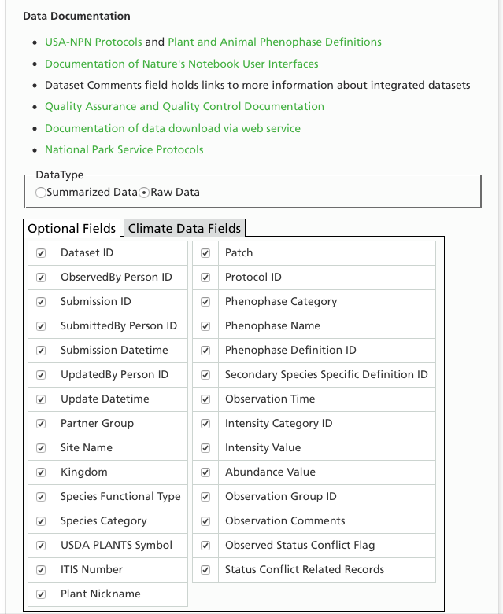
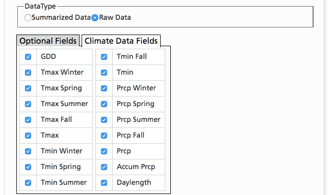
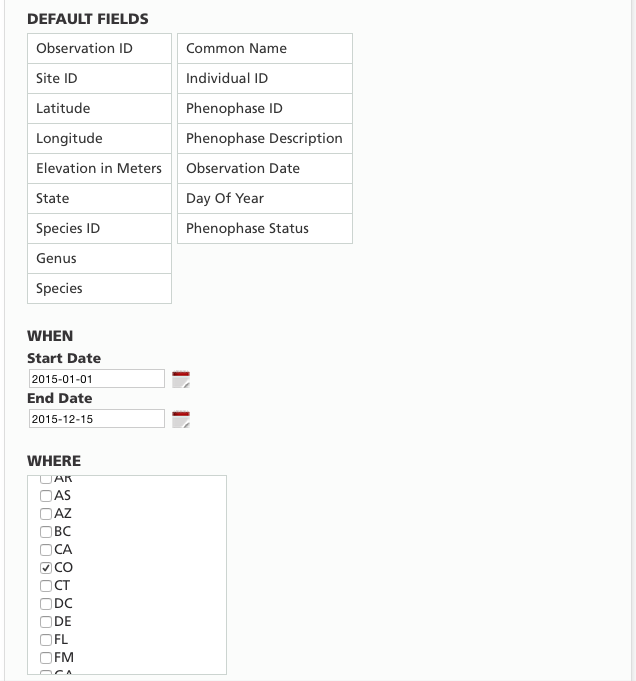
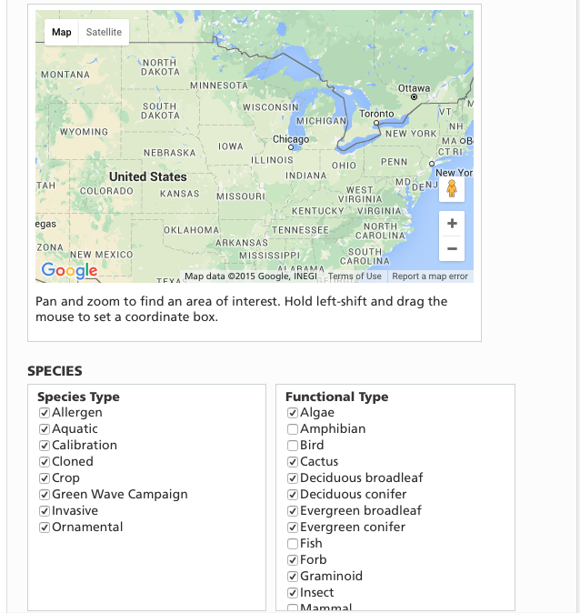

# USA National Phenology Network (NPN)
Two example datasets are posted here. The first is for student observations at Wakarusa Wetland. Per Brian Miller: "In particular, we have worked with Dan Wildcat at Haskell Indian Nations University to support tribal college students to collect observations at Wakarusa Wetlands (to access these specific data, select “Raw Data”, then scroll down to “PARTNER GROUPS, Primary Network” and select “Wakarusa Wetlands Indigenous Trail" (background on this project is available here: https://www.usanpn.org/nn/indigenous-phenology-network)"

The second example dataset includes all available parameters for all plant records in Colorado for 2015-01-01 to 2015-12-15, downloaded from https://www.usanpn.org/results/data. Included are raw data and summary data. 

#### Screenshots taken for this download
##### Documentation & Optional Fields

##### Climate Fields

##### Time and Location

##### Species Types and Functional Types

##### Phenophase Categories

